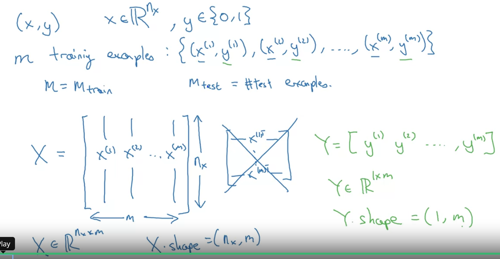
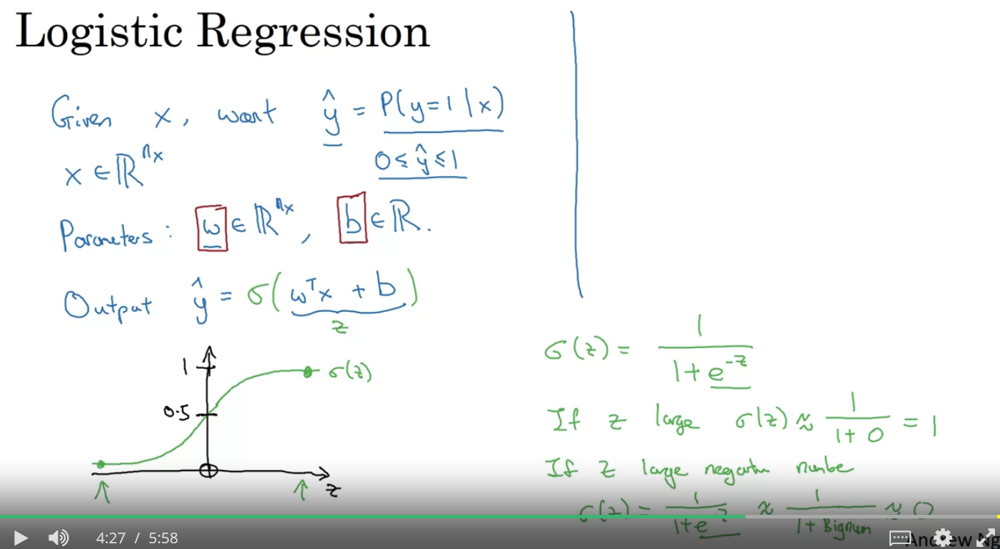
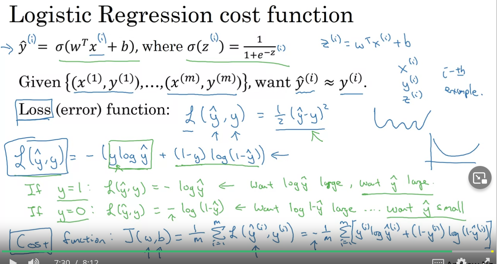
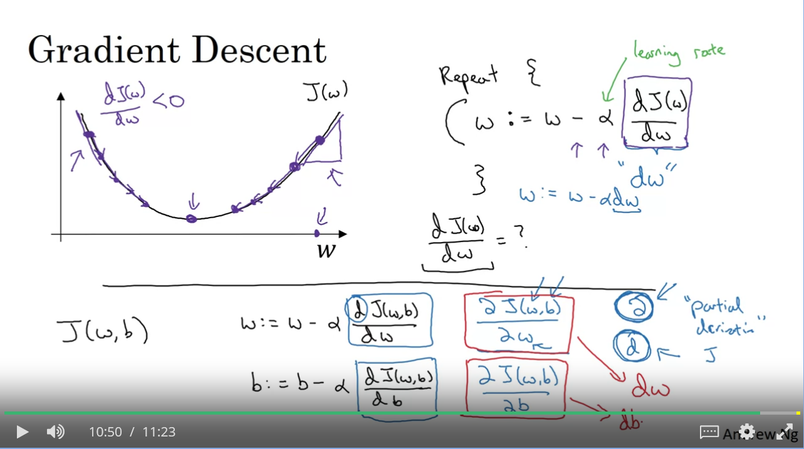
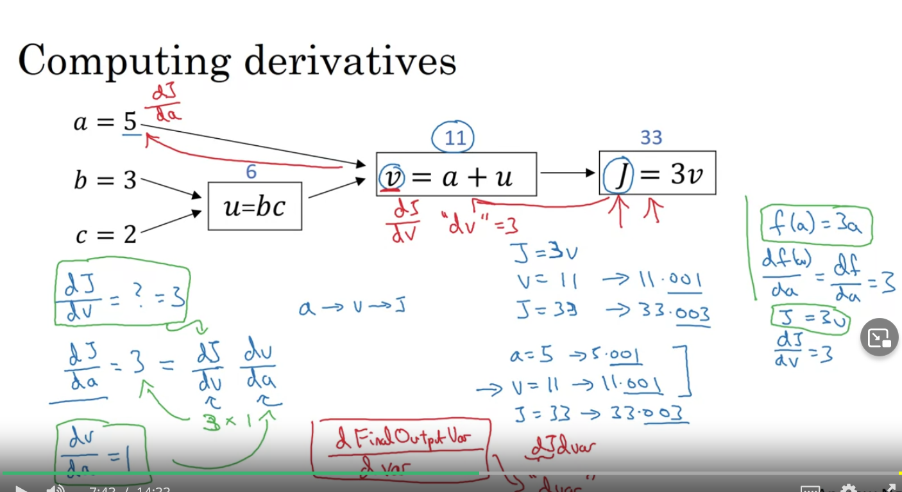
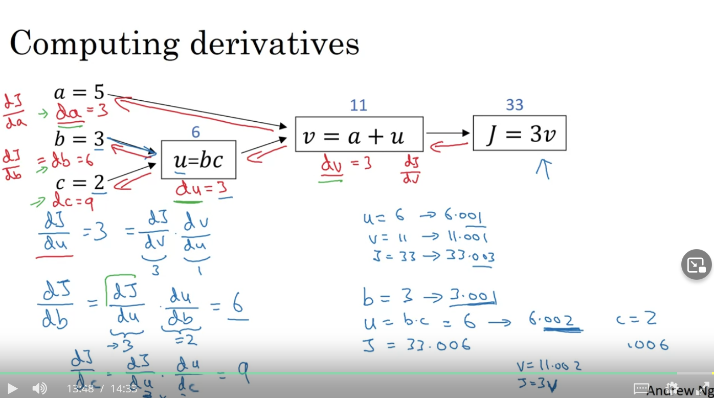
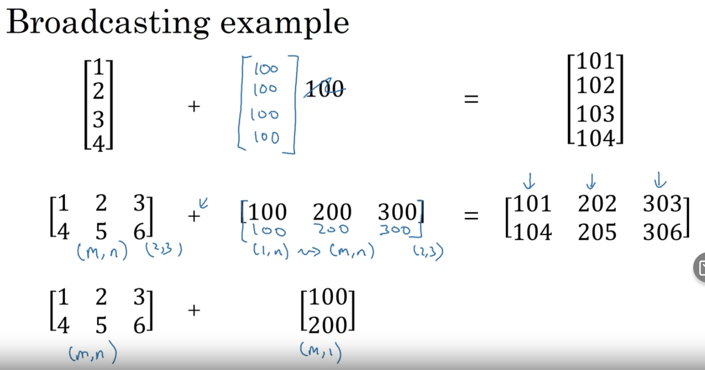

# Notations and definitions


- m - number of training examples
- mtrain - same
- mtest - number of test examples
- nx - size of one training example
- X - train set - shape (nx, m)
- Y - output - shape (1, m)
- Y^ - prediction of real Y
- w, b - calculated weights (just linear regression...)
- z - calculated weight -> = W.T • B
- a - activated Z (e.g. relu(Z))
- L - loss function -> Lfun(y^, y) -> computes loss based on prediction and real value
    - loss func depends on type of output
    - **metric for network per single training example**
- J - cost function
    - J = 1/m * np.sum(L) -> average of of all losses
    - **metric for network per whole trainig set**
- ⍺ - learning rate -> used for back propagation
# Logistic regression
- used for binary classification
- outpt [0/1]
## Some equation:
- y^ = P(y=1 | x) -> 0 <= y^ <= 1
## Parameters:
- w - nx dim vector
- b - number

## Output y^:
- y^ = sig(wT x + b)
- z(i) = (wTx(i) + b)


## Logistic regression cost function
- measures how well is regression working on all dataset -> J(w,b)
- L


## Gradient
- Gradient


## Derivatives with a Computation Graph
- Computation derivatives

- Computation derivatives solved


### Vectorizing LR in python
```python
Z = np.dot(w.T, X) + b  # z = (wTx + b) -> python will expand b
A = sigmoid(Z)          # sigmoid function
```
### Vectorizing LR Gradient in python
```python
# Y -> output
A = sigmoid(Z)          # sigmoid function
dz = A - Y
dw = 1/m * np.dot(X,dz.T)
db = 1/m * np.sum(dz)
```

## Vectorization in Python
```python
c = c.T           # to transpose
c = np.dot(a, b)  # dot product (Iloczyn skalarny) A•B = A^T * B
u = np.exp(v)     # element wise
u = np.log(v)     # element wise
u = np.abs(v)     # element wise
u = np.max(v)     # element wise
V ** Z            # element wise square
1/V               # element wise inverse
```
### V other operations

```python
cal = A.sum(axis=0) # -> calculate sum over axis! -> gives vector at output
a = A.reshape(1,4)
N = np.zeros(1, 100)
S = N + 100 # -> 100 will be reshaped to 1,100
a = np.zeros(4) # -> rank 1 array, do not use!!
a = np.zeros(4, 1) # -> column vector
a = np.zeros(1, 4) # -> row vector
a.shape() # -> to get shape
assert(a.shape == (5,1)) # -> if not sure check dimensions!
```
### Common functions
e.g.
```python
v = image.reshape(image.shape[0]*image.shape[1]*image.shape[2],1)
# Normalization
x_norm = np.linalg.norm(x, axis=1, keepdims=True)
x = x/x_norm
# Sum of vectors
x_sum = np.sum(x, axis =1, keepdims = True)
```