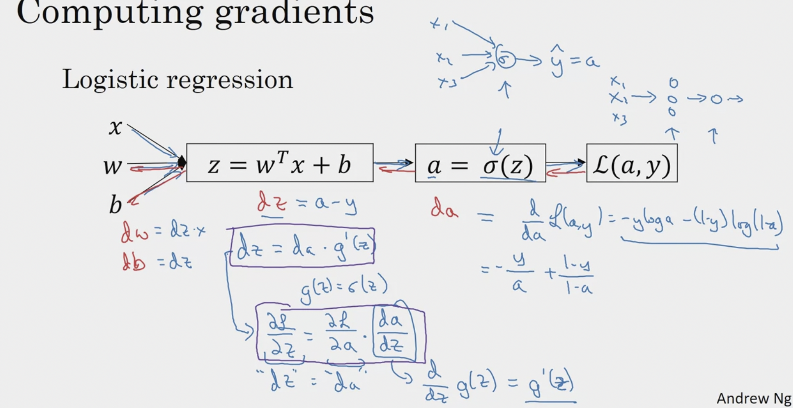

# Neural Network

## Notations
- this is for multiple training sets at one time! (note the uppercase)
- see images: NN_representation2 vs vectorizing
- the number of examples per epoch is known as *batch_size*
- X - features
- Y - labels
### Forward propagation
- X or A0 - input stacked features vector (matrix)
- Y - output vector -> real
- Z1 - weights of hidden layer W1.T • B1
- A1 = g1(Z1), where g1 is a activation function, A1 is calculated activation on hidden layer (activation 1)
- Z2 - weights of output layer W2.T • B2
- Y^ or A2 - calculated result
    - sigmoid(Z2), A2 is calculated activation on output layer (activation 2)
### Back propagation (see gradient)
- dZ2 = A2 - Y
- dW2 = 1/m * np.dot(dZ2, A1.T)
- db2 = 1/m * np.sum(dZ2, axis=1, keepdims=True)
- dZ1 = np.dot(W2.T, dZ2) * g1'(Z1)
- dW1 = 1/m * np/dot(dZ1, X.T)
- db1 = 1/m * np.sum(dZ1, axis=1, keepdims=True)
### Update parameters
- W1 = W1 - ⍺ * dW1
- W2 = W2 - ⍺ * dW2
- B1 = B1 - ⍺ * db1
- B2 = B2 - ⍺ * db2

## Activation function
### Why do we use act function on?:
- e.g. (relu, tanh, sigmoid)
- without it we would have logistic regression -> one layer NN
- hidden layers only work if we add some Non-Linear stuff
- it makes hidden layers work.

## Derivatives of Activation Functions
- used to calculate back propagarion -> for gradient descent

## Gradient Descent for Neural Networks
- for back propagation
- used to update W and B parameters
- finds minimum
### Where are this values are comming from:
- from gradient of L(A2, Y) -> see computional graph!
- gradient in cartesian = df/fdx + df/dy + df/dz
- e.g. f(x,y,z)=2x+3y^2 -sin(z) => gradf  = 2i + 6yj - cos(z)k

## Cost and loss
-
### loss
- metric of how well the network is performing per single training example
### Cost
- metric of how well the network is performing per whole trainig set

## Slides

### Computing Gradients

## Random initialization
- init 0 do not work for NN (problem with W parameter)
- all hidden units (W) are (symmetric), so they stay identical (Rows will be the same)
- usually init with np.random.rand((2,2)) * 0.01 -> small value

## What does this have to do with the brain?
- for simplification
- single logistic unit activation looks like a neuron:
    - like artificial neuron, real neuron gets input (electrical signals) and passes them to the next one

## The general methodology to build a Neural Network is to:
1. Define the neural network structure ( # of input units,  # of hidden units, etc). 
2. Initialize the model's parameters
3. Loop:
    - Implement forward propagation
    - Compute loss
    - Implement backward propagation to get the gradients
    - Update parameters (gradient descent)