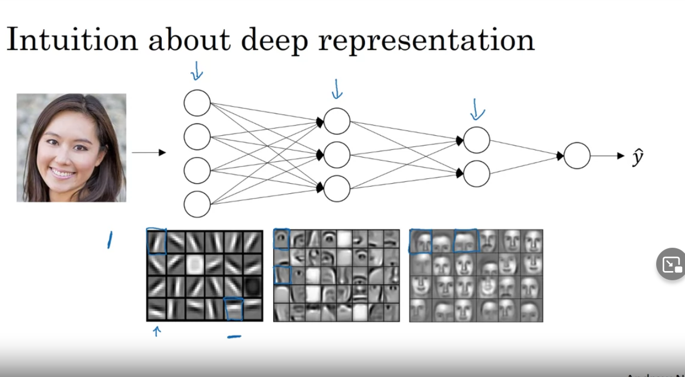

# Deep L-layer Neural Network
- a network with more than one hidden layer
## Notation
- L - number of layers
- n[l] - number of units(neurons) in l-th layer
- a[l] - activations in layer l
- w[l] - weights in layer l
- a[0] - activations of input layer - X
- a[L] - output of the network - Y^

## Forward propagation in a deep network
- Standard:
    - z[l] = w[l] a[l-1] + b[l]
    - a[l] = g[l] (z[l])
- Vectorized:
    - Z[l] = W[l] A[l-1] + b[1]
    - A[l] = g[l] (Z[l])

## Getting dimensions right
- Standart
    - z[l], A[l] : (n[l], 1)
    - x[l] : (n[l-1], 1)
    - w[l] : (n[l], n[l-1])
    - b[l] : (n[l], 1)

- Vectorized
    - Z[l], A[l] : (n[l], m)
    - X[l] : (n[l-1], m)
    - W[l] : (n[l], n[l-1])
    - b[l] : (n[l], m)
- all d... have same dimensions as its originals

## Why deep representation
- first layers detects features
- later layers are composing features together to find more complex patterns
- Circuit theory and deep learning (to compute XOR on n elements):
    - For deep -> depth -> O(log n)
    - For shallow -> hidden layer size: 2^(n-1)!
    - deep networks grows logarithmically
    - shallow network grows exponentially
- Deep networks work great for some types of problems




## Forward propagation
- Input - A[l-1]
- Output - A[l], (also: cache Z[l])
    - Z[l] = W[l] A[l-1] + b[1]
    - A[l] = g[l] (Z[l])

## Back propagation
- Input - dA[l], (also: cache Z[l])
- Output - dA[l-1]
    - dZ[l] = dA[l] * g[l]' (Z[l])
    - dW[l] = 1/m dZ[l] A[l-1].T
    - db[l] = 1/m np.sum(dZ[l], axis=1, keepdims=True)
    - dA[l-1] = W[l].T dZ[l]

## Farward and back propagation diagram

```
             layer l
            +---------+
            |         |
 A[l-1] --> |         | --> A[l]
            |         |
            +---------+
                 |
                 |  Cache Z[l]
                 v
            +---------+
            |         |
dA[l-1] <-- |         | <-- A[l]
            |         |
            +---------+
                 |
                 |  dW[l], db[l]
                 v
```

## Parameters vs Hyperparameters
- Parameters: W, b...
- Hyperparameters:
    - Learning rate - alpha
    - No. iterations
    - No. hidden layers - L
    - No. hidden units n[1], n[2]... 